# Cross Paradigm Representation and Alignment Transformer for Image Deraining


[]()
[]()
[](https://zs1314.github.io/DAIT/)

#### 🔥🔥🔥 News
- **2025-02-10:** This repo is released.

---

> **Abstract:** Transformer-based networks leveraging spatial or
channel self-attention have achieved remarkable performance in
image deraining tasks, inspiring us to utilize spatial and channel
dimensions simultaneously. However, single-architecture feature
representations struggle to handle real-world rain variations,
making rich global-local information essential. We propose the
Dual Aggregation Interaction Transformer (DAIT), leveraging
the strengths of two paradigms (spatial-channel and globallocal) while enabling deep intra- and inter-paradigm interaction
and fusion. Specifically, we propose two types of self-attention:
Sparse Prompt Channel Self-Attention (SPC-SA) and Spatial
Pixel Refinement Self-Attention (SPR-SA). SPC-SA uses dynamic
sparsity to enhance global dependencies and facilitate channel
context learning. SPR-SA emphasizes spatially varying rain
distribution and local texture restoration. To address knowledge
disparity, we introduce the Frequency Adaptive Interaction
Module (FAIM) to eliminate feature isolation within and between
paradigms progressively. Additionally, we employ a Multi-Scale
Flow Gating Network (MSGN) to extract scale-aware features.
Extensive experiments demonstrate DAIT achieves state-of-the-art
performance on six benchmark datasets.

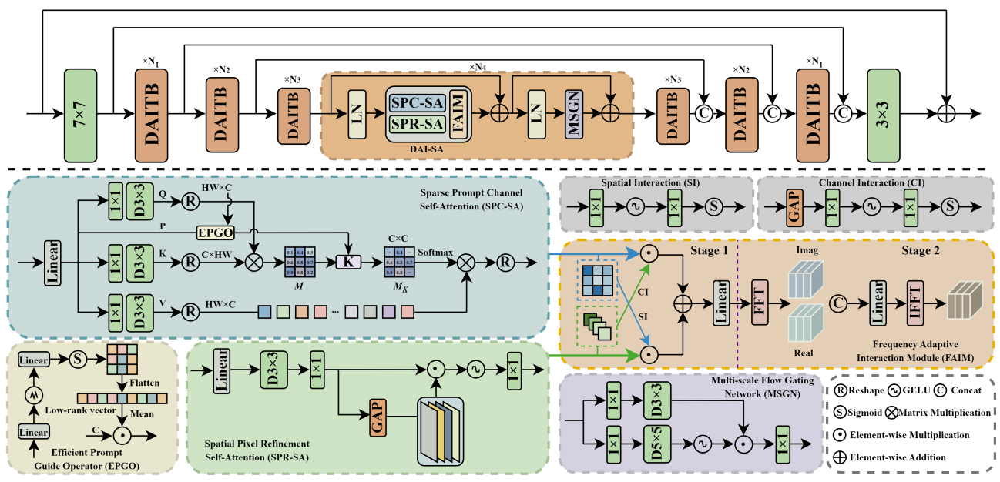

---


## ⚙️ Dependencies

- Python 3.8
- PyTorch 1.9.0
- NVIDIA GPU + [CUDA](https://developer.nvidia.com/cuda-downloads)

```bash
# Clone the github repo and go to the default directory 'DAIT'.
git clone https://github.com/zs1314/DAIT.git
conda create -n DAIT python=3.8
conda activate DAIT
pip install matplotlib scikit-image opencv-python yacs joblib natsort h5py tqdm
```
Install warmup scheduler
```bash
cd pytorch-gradual-warmup-lr; python setup.py install; cd ..
```
## ⚒️ TODO

* [x] Release code


## 🔗 Contents

1. [Datasets](#datasets)
1. [Training](#training)
1. [Testing](#testing)
1. [Results](#results)
1. [Citation](#citation)
1. [Contact](#contact)
1. [Acknowledgements](#acknowledgements)

---


## <a name="datasets"></a>🖨️ Datasets

Used training and testing sets can be downloaded as follows:

| Training Set                                                                                                                                                                                                           |                                                                                                                    Testing Set                                                                                                                    |                        Visual Results                        |
|:-----------------------------------------------------------------------------------------------------------------------------------------------------------------------------------------------------------------------|:-------------------------------------------------------------------------------------------------------------------------------------------------------------------------------------------------------------------------------------------------:| :----------------------------------------------------------: |
| Rain13K[complete training dataset: [Google Drive](https://drive.google.com/drive/folders/1Hnnlc5kI0v9_BtfMytC2LR5VpLAFZtVe) / [Baidu Disk](https://pan.baidu.com/s/1uYgoetlYGK_iOQ4XMbRExw?pwd=wzkw)]     | Test100 + Rain100H + Rain100L + Test2800 + Test1200 [complete testing dataset: [Google Drive](https://drive.google.com/drive/folders/1PDWggNh8ylevFmrjo-JEvlmqsDlWWvZs) / [Baidu Disk](https://pan.baidu.com/s/1uYgoetlYGK_iOQ4XMbRExw?pwd=wzkw)] | [Google Drive]() / [Baidu Disk]() |

Download training and testing datasets and put them into the corresponding folders of `Datasets/`. See [Datasets](Datasets/README.md) for the detail of the directory structure.


## <a name="training"></a>🔧 Training

- Download [training](https://pan.baidu.com/s/1uYgoetlYGK_iOQ4XMbRExw?pwd=wzkw) (Rain13K, already processed) and [testing](https://pan.baidu.com/s/1uYgoetlYGK_iOQ4XMbRExw?pwd=wzkw) (Test100 + Rain100H + Rain100L + Test2800 + Test1200 , already processed) datasets, place them in `Datasets/`.

- Run the following scripts. The training configuration is in `training.yml`.

  ```shell
  python train.py
  ```

- The training experiment is in `checkpoints/`.


## <a name="testing"></a>🔨 Testing


- Download [testing](https://pan.baidu.com/s/1uYgoetlYGK_iOQ4XMbRExw?pwd=wzkw) (Test100 + Rain100H + Rain100L + Test2800 + Test1200) datasets, place them in `Datasets/`.

- Run the following scripts. The testing configuration is in `test.py`.

  ```shell
    python test.py
  ```

- The output is in `results/`.
- To reproduce PSNR/SSIM scores of the paper, run (in matlab):
  ```shell
    evaluate_PSNR_SSIM.m 
  ```

## <a name="results"></a>🔎 Results

We achieve state-of-the-art performance. Detailed results can be found in the paper.

<details>
<summary>Quantitative Comparison (click to expand)</summary>

- results in Table 1 of the main paper

<p align="center">
  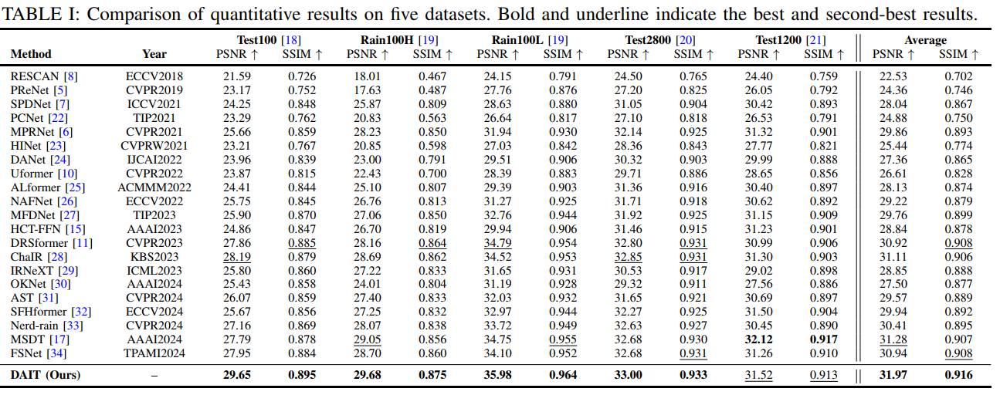
</p>

- results in Table 2 of the main paper

<p align="center">
  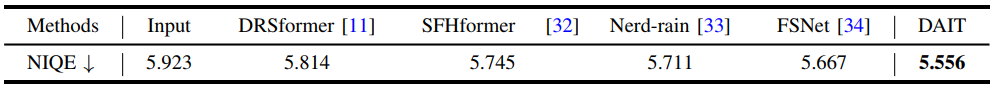
</p>

- results in Table 2 of the supplementary material

<p align="center">
  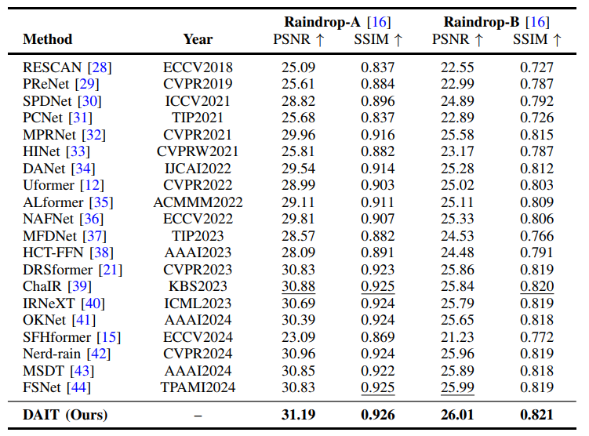
</p>

- results in Table 1 of the supplementary material

<p align="center">
  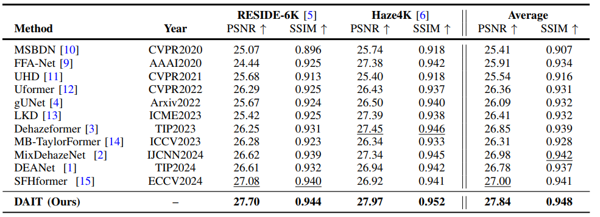
</p>

- results in Table 5 of the supplementary material

<p align="center">
  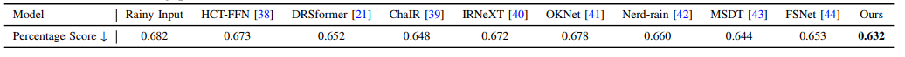
</p>
</details>

<details>
<summary>Visual Comparison (click to expand)</summary>

- results in Figure 5 of the supplementary material

<p align="center">
  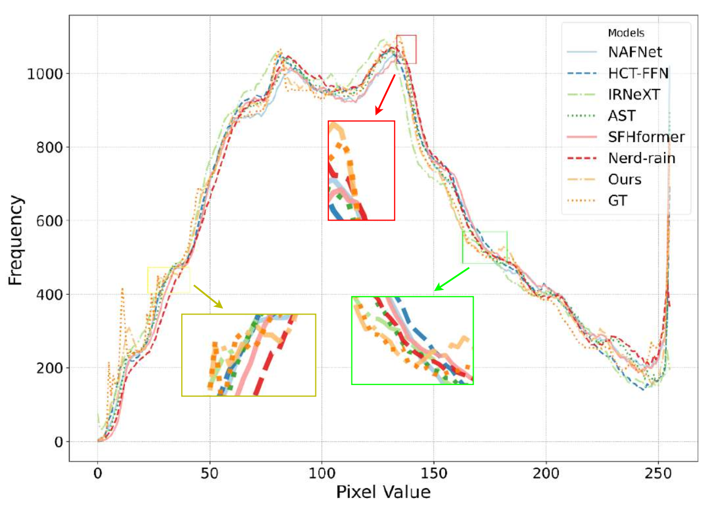
</p>

- results in Figure 6 of the main paper

<p align="center">
  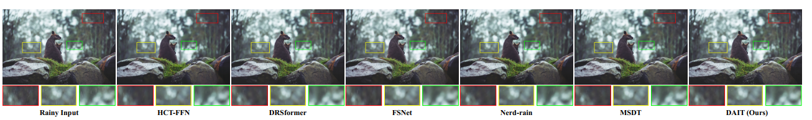
</p>


- results in Figure 4 of the supplementary material

<p align="center">
  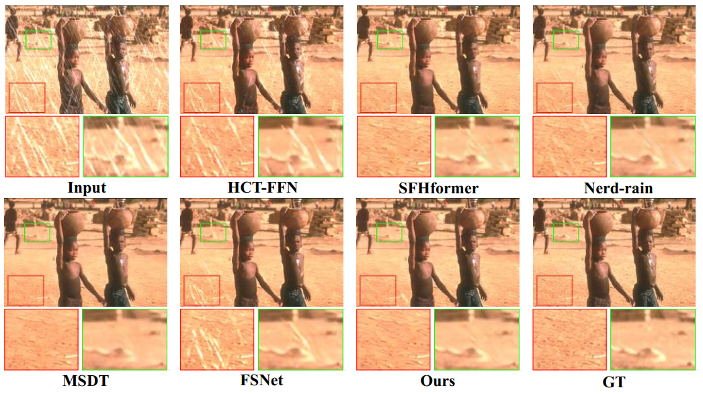
</p>


- results in Figure 7 of the supplementary material

<p align="center">
  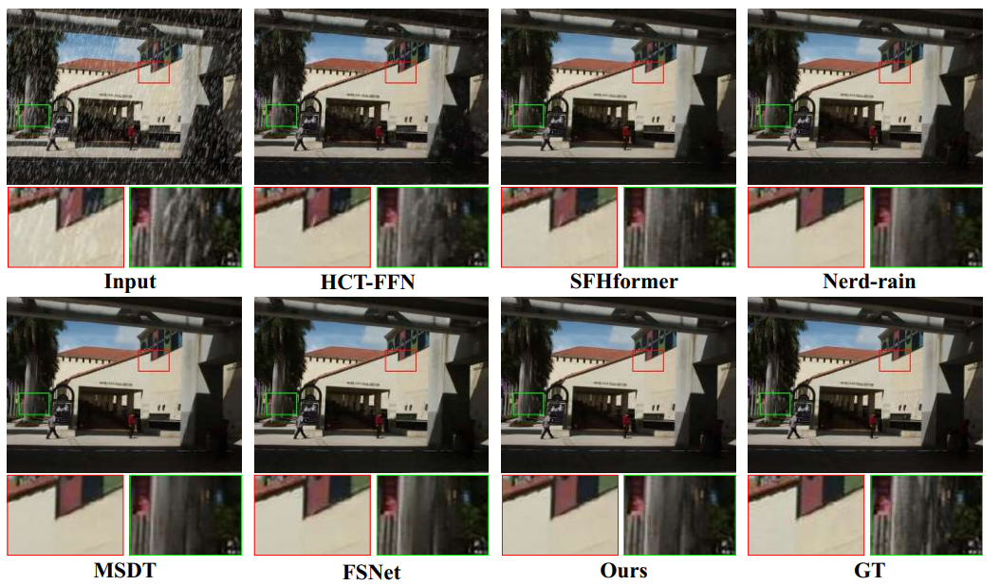
</p>

- results in Figure 9 of the supplementary material

<p align="center">
  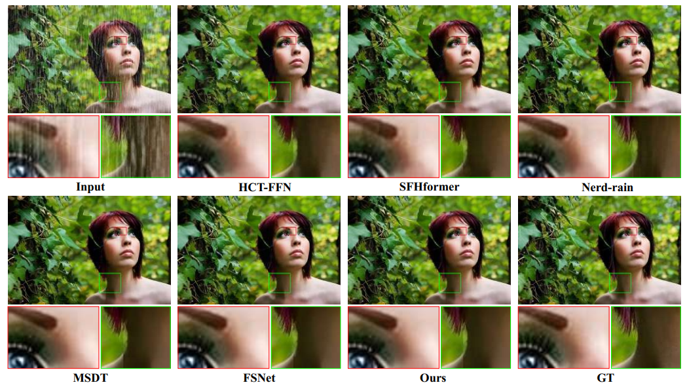
</p>

- results in Figure 2 of the supplementary material

<p align="center">
  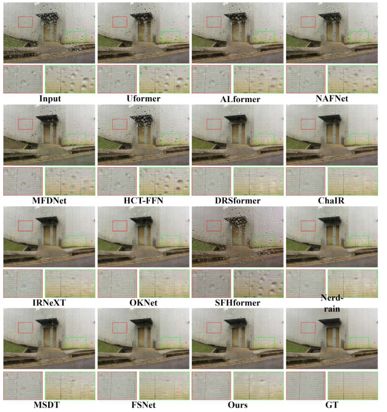
</p>

- results in Figure 1 of the supplementary material

<p align="center">
  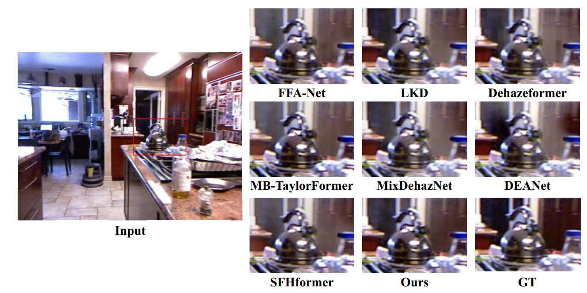
</p>

- results in Figure 11 of the supplementary material

<p align="center">
  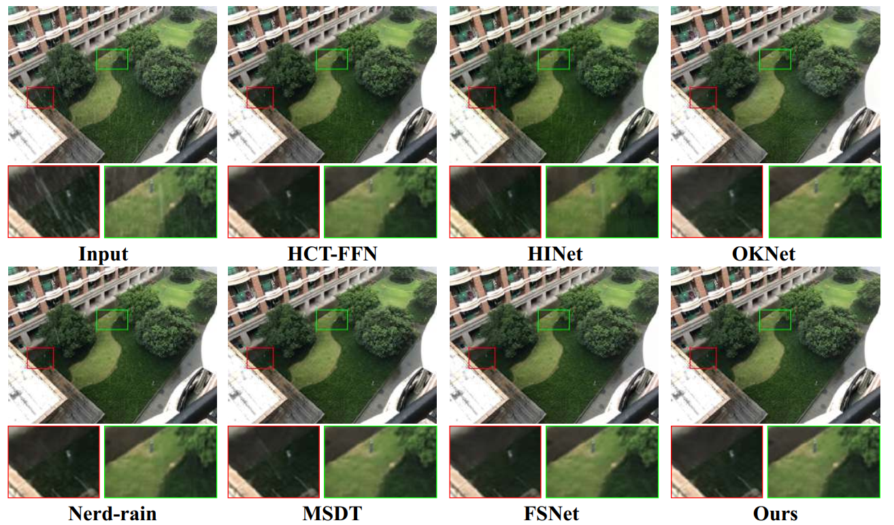
</p>
</details>

## <a name="contact"></a>📂 Contact
Should you have any question, please contact shunzou.njau@gmail.com


## <a name="citation"></a>📎 Citation

We kindly request that you cite our work if you utilize the code or reference our findings in your research:
```
@inproceedings{zou2025cpraformer,
  title={Cross Paradigm Representation and Alignment Transformer for Image Deraining},
  author={Zou, Shun and Zou, Yi and Li, Juncheng and Chen, Zhihao and Gao, Guangwei and Qi, Guojun},
  booktitle={},
  year={2025}
}
```


## <a name="acknowledgements"></a>💡 Acknowledgements

This code is built on [MPRNet](https://github.com/swz30/MPRNet).

